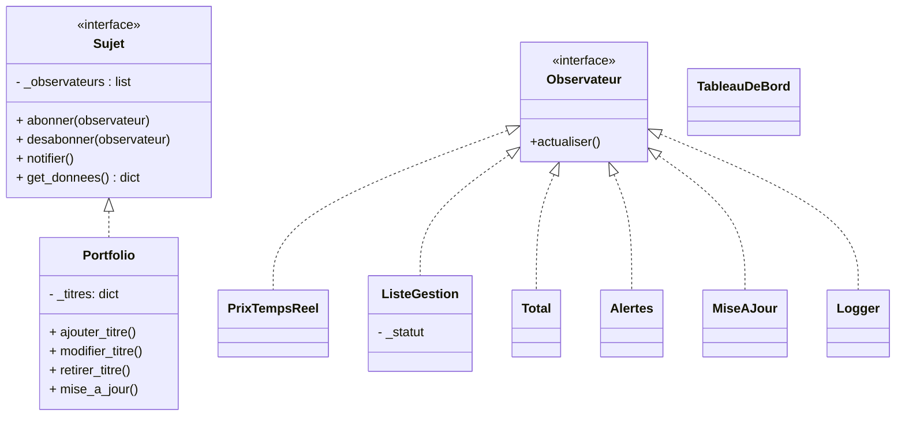

```mermaid
classDiagram
	class Sujet{
		<<interface>>
		- _observateurs : list
		+ abonner(observateur)
		+ desabonner(observateur)
		+ notifier()
		+ get_donnees() dict
	}
	class Observateur{
		<<interface>>
		+actualiser()
	}
	class PrixTempsReel
	class ListeGestion{
	- _statut
	}
	class Total
	class Alertes
	class MiseAJour
	class Logger
	class TableauDeBord
	class Portfolio{
		- _titres: dict
		+ ajouter_titre()
		+ modifier_titre()
		+ retirer_titre()
		+ mise_a_jour()
	}
	Observateur <|.. PrixTempsReel
	Observateur <|.. ListeGestion
	Observateur <|.. Total
	Observateur <|.. Alertes
	Observateur <|.. MiseAJour
	Observateur <|.. Logger
	Sujet <|.. Portfolio
	
```
un autres sujet pour les titres peut-être?